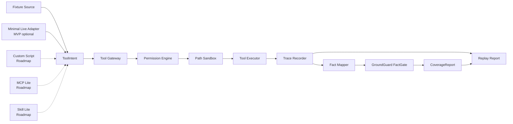

# AgentTrust Runtime 最终实施方案

> **执行状态更新（2026-07-08）**
>
> 本文档已经合并 `AgentTrust-Runtime-MVP收缩执行方案.md`，从现在起作为唯一执行口径。原 MVP 收缩方案中的硬规则已内嵌到本最终实施方案。
>
> MVP 必须收缩到核心链路：`ToolIntent -> Tool Gateway -> Permission Engine -> Path Sandbox -> Trace -> GroundGuard FactGate -> Replay/Report`。
>
> Week 5/6 中的 MCP Lite、Skill Lite、Recovery Lite、Tool Registry Lite、Hook Lite、Memory Lite、Context Lite 统一降级为 Roadmap，不混入 MVP。MVP 最多只加一个增强点：`agenttrust run-live fake_tool_request` 形式的极简 live adapter。

## 1. 最终结论

AgentTrust Runtime 可以立项，但必须按“收缩后的工程作品”执行。

最终定位：

> AgentTrust Runtime 是一个 local-first 的 Agent runtime 工程项目，用来展示权限控制、路径沙箱、工具调用 trace，以及 GroundGuard 驱动的最终回答事实校验闭环。

它不是行业首创，不对标 Microsoft Agent Governance Toolkit、Invariant MCP-Scan、Cisco MCP Scanner、Snyk Agent Scan、AgentOps、Braintrust、Phoenix，也不声称覆盖完整企业治理。

这个项目的价值是：

1. 展示你理解 Agent runtime 的关键控制点；
2. 展示你能把 policy、sandbox、trace、fact verification 串成真实可运行链路；
3. 展示你能复用 GroundGuard，而不是又做一个孤立 demo；
4. 展示你理解 MCP、Skill、Agent adapter 这些 Agent 生态能力如何接入同一条 runtime 主链路，但它们先放 Roadmap；
5. 展示你理解 coding-agent 生态中的 recovery、tool registry、hook 扩展点，但 MVP 不把这些扩展混进主线；
6. 展示你做项目前会查 prior art、验证依赖边界、收缩范围。

### 1.1 MVP 必做范围

MVP 只交付下面这些内容，任何新增功能如果不能强化主链路，就先放 Roadmap：

- ToolIntent schema；
- ToolResult schema；
- Tool Gateway；
- Permission Engine；
- Path Sandbox；
- `read_file`；
- `write_file`；
- `shell`；
- `git_diff`；
- append-only `trace.jsonl`；
- `agenttrust run-fixture`；
- `agenttrust run-live fake_tool_request`；
- `agenttrust replay`；
- `agenttrust report`；
- `agenttrust policy validate`；
- GroundGuard adapter；
- deterministic fixtures：`blocked_secret`、`ask_noninteractive`、`verified_answer`、`contradicted_answer`、`unverified_answer`；
- README；
- THREAT_MODEL；
- RELATED_WORK；
- pytest + CI。

MVP 不做完整企业治理平台、不做完整 MCP scanner、不做 coding assistant，也不对标 Microsoft Agent Governance Toolkit、Invariant、Cisco、Snyk、AgentOps、Braintrust、Phoenix 的完整能力。

## 2. 项目主线

MVP 只做一条链路：

```text
Input Source
  -> ToolIntent
  -> Tool Gateway
  -> Permission Engine
  -> Path Sandbox
  -> Tool Execution
  -> Append-only Trace
  -> Fact Mapper
  -> GroundGuard FactGate
  -> Replay / Report
```

其中 `Input Source` 在 MVP 中只包括 fixture source 和极简 live adapter。关键原则是：

> fixture demo 和真实 Agent 必须走同一套 Tool Gateway、Permission Engine、Trace Recorder、FactGate 代码路径，只是发起 tool intent 的来源不同。

这条原则要锁死。不能为了 demo 另写一套绕过 runtime 的脚本。

### 2.1 Agent 生态能力 Roadmap

为了展示 MCP、skills、agent adapter 等能力，方案保留一个后续展示层，但它不进入前四周 MVP，也不改变核心主线。

Roadmap 展示层包括：

1. **MCP Lite**：解析 MCP config，列出 server/tool，并把一次 MCP tool call 包装成 `ToolIntent` 进入 Gateway。
2. **Skill Lite**：加载本地 `SKILL.md` 和 `policy.yaml`，把 skill 的 allowed tools、blocked tools、required facts 绑定到本次 run。
3. **Agent Adapter Lite**：在 MVP 的极简 live adapter 之后，接手写 `ai-interview-agent`，再接 LangGraph `nlp-exam-agent`。

关键原则：

- MCP tool 不绕过 Gateway；
- Skill 不直接执行工具，只限制和生成 ToolIntent；
- Agent adapter 只负责把 Agent 的工具请求转成 ToolIntent；
- 所有 MCP/Skill/Agent 运行都共享同一个 `run_id`、trace、policy、FactGate。

### 2.2 mewcode 对照后的 Roadmap 取舍

mewcode 这类 terminal coding assistant 还覆盖了 worktree、rewind、memory、hooks、context compaction、subagent/team、tool search/deferred tools、file history 等能力。

AgentTrust Runtime 不盲目复刻这些能力，只把与本项目主线强相关的部分放入 Roadmap：

1. **Recovery Lite**：写文件前备份，支持 `restore <run_id>`，展示“Agent 写坏了能恢复”。
2. **Tool Registry Lite**：列出和 inspect 工具 schema/scope，展示工具面治理。
3. **Hook Lite**：提供最小 `pre_tool` 扩展点，展示 runtime 可扩展性。
4. **Memory Lite**：保存项目级人工确认记忆和 run summary，展示 Agent 可复用上下文。
5. **Context Lite**：按 skill/tool/policy 构建受控上下文包，展示 context budget 和可追踪注入。

暂不做：

- 自动长期人格记忆；
- LLM 自动上下文压缩；
- subagent/team；
- TUI；
- remote skill install；
- full worktree manager。

这些属于 coding assistant 体验层，不是 AgentTrust Runtime 的 MVP 主线。前四周不实现这些能力。

## 3. 架构设计



### 3.1 输入源

MVP 支持两类输入源：

- `fixture source`：用于稳定 demo 和 pytest；
- `minimal live adapter`：`agenttrust run-live fake_tool_request`，用于证明真实 Agent adapter 的入口存在，但不引入完整 LLM workflow。

Roadmap 可选支持：

- `custom script source`：用于后续手写 tool intent；
- `live agent adapter`：接入 `ai-interview-agent` 或 `nlp-exam-agent`；
- `mcp lite source`：把 MCP tool call 包装为 ToolIntent。
- `skill lite source`：把本地 skill 的工具范围和输出契约绑定到 run。

必须明确：

- fixture 不是独立 demo harness；
- fixture 只是把预置的 `ToolIntent` 喂给 Gateway；
- Gateway 之后的所有代码路径必须和真实 Agent 一致。

## 4. CLI 命令定稿

MVP 命令只覆盖核心链路和一个极简 live adapter。Roadmap 命令保留设计，但不进入前四周验收。

### 4.1 初始化

```bash
agenttrust init
```

生成：

```text
.agenttrust/
  policy.yaml
  runs/
```

### 4.2 运行 fixture

```bash
agenttrust run-fixture blocked_secret
agenttrust run-fixture ask_noninteractive --non-interactive
agenttrust run-fixture verified_answer
agenttrust run-fixture contradicted_answer
agenttrust run-fixture unverified_answer
```

`run-fixture <name>` 是面试演示和 CI 的主命令，保证 100% 可复现。

### 4.3 运行极简 live adapter

```bash
agenttrust run-live fake_tool_request
```

这不是完整 LLM agent，只是最小 live adapter 证据：`FakeModelToolRequest -> ToolIntent -> same Gateway / Permission / Sandbox / Trace / FactGate path`。

### 4.4 复盘

```bash
agenttrust replay <run_id>
```

输出本次运行的 timeline：

- tool intent；
- permission decision；
- sandbox decision；
- tool result；
- fact mapper result；
- GroundGuard coverage；
- final answer status。

### 4.5 生成报告

```bash
agenttrust report <run_id>
agenttrust report <run_id> --format html
agenttrust report <run_id> --format markdown
```

### 4.6 策略校验

```bash
agenttrust policy validate .agenttrust/policy.yaml
```

这个命令可选，但实现成本低，适合 MVP 加入。

### 4.7 Roadmap：Tool Registry Lite（不进 MVP）

```bash
agenttrust tools list
agenttrust tools inspect shell
agenttrust tools inspect mcp_tool
```

Roadmap 版本只展示：

- tool name；
- category；
- input schema；
- default permission effect；
- whether enabled；
- source: builtin / mcp_lite / skill_context。

不做 deferred loading、BM25 tool search、动态安装。

### 4.8 Roadmap：MCP Lite（不进 MVP）

```bash
agenttrust mcp inspect .mcp.json
agenttrust mcp inspect claude_desktop_config.json
agenttrust run-fixture mcp_tool_denied --non-interactive
agenttrust run-fixture mcp_tool_approved --mode test
```

Roadmap 版本只做 inspect 和 wrapper：

- 读取 MCP config；
- 列出 server name、command、env keys、tool names、tool schema 摘要；
- 对明显风险给出提示；
- 把 fixture 中的一次 MCP tool call 包装为 `ToolIntent(tool_name="mcp_tool")`；
- 后续仍然进入 Permission Engine、Trace Recorder、FactGate。

不做完整 MCP scanner，不做远程 server 深度连接，不做 MCP proxy。

### 4.9 Roadmap：Skill Lite（不进 MVP）

```bash
agenttrust skills list
agenttrust skills inspect code-review
agenttrust run --skill code-review "review this repository"
agenttrust run-fixture skill_code_review
```

Roadmap 版本只加载本地 skill：

```text
.agenttrust/skills/code-review/
  SKILL.md
  policy.yaml
```

Skill 的作用：

- 提供 instruction；
- 限制 allowed tools；
- 声明 blocked tools；
- 声明 required fact keys；
- 声明 output contract；
- 把这些约束写入 trace。

不做 skill marketplace，不做远程安装，不做动态下载。

### 4.10 Roadmap：Recovery Lite（不进 MVP）

```bash
agenttrust restore <run_id>
agenttrust restore <run_id> --file src/app.py
agenttrust restore <run_id> --dry-run
```

Roadmap 版本只支持 `write_file` 的回滚：

- `write_file` 执行前备份原文件；
- 新文件记录为 created file；
- restore 时恢复旧内容或删除新建文件；
- 所有 restore action 写入新的 trace event。

不做 conversation rewind，不做 git worktree rollback，不做复杂三方 merge。

### 4.11 Roadmap：Hook Lite（不进 MVP）

```bash
agenttrust hooks list
agenttrust run-fixture blocked_by_hook
```

Roadmap 版本只支持 `pre_tool` hook：

```yaml
hooks:
  pre_tool:
    - id: block-large-write
      when:
        tool: write_file
        path_glob: "src/**"
      action: deny
      reason: "source writes must go through approval"
```

Hook 的定位：

- 作为 policy 之外的轻量扩展点；
- 只能 deny 或 add trace note；
- 不能执行 shell；
- 不能访问网络；
- 不做 post_tool webhook；
- 不做 prompt injection hook。

### 4.12 Roadmap：Memory Lite（不进 MVP）

```bash
agenttrust memory list
agenttrust memory add project "GroundGuard is used as the fact verification engine."
agenttrust memory add decision "MVP uses fixture sources for deterministic demos."
agenttrust memory inspect
agenttrust memory clear --scope run
```

Roadmap 版本只做本地、显式、可审计记忆：

```text
.agenttrust/memory/
  project.md
  decisions.jsonl
  run-summaries.jsonl
```

Memory Lite 保存三类内容：

- `project`：项目级稳定事实，例如使用 GroundGuard、MVP 范围、demo 约束；
- `decision`：人工确认过的架构决策，例如 ask 策略、fixture 策略；
- `run_summary`：每次 run 的摘要，包括工具调用数量、deny/ask/allow 统计、GroundGuard 结果。

不做：

- 自动人格记忆；
- 从任意对话中自动抽取长期记忆；
- 跨项目云同步；
- embedding 检索；
- LLM 自动 consolidation。

### 4.13 Roadmap：Context Lite（不进 MVP）

```bash
agenttrust context build --skill code-review
agenttrust context preview --skill code-review --budget 4000
agenttrust context export --run <run_id>
```

Context Lite 的作用：

- 从 `policy.yaml`、skill、memory、tool registry、recent trace 中构建 context pack；
- 按预算裁剪；
- 记录哪些内容被注入；
- 把 context pack 写入 run artifact，方便 replay。

生成文件：

```text
.agenttrust/runs/{run_id}/context-pack.md
.agenttrust/runs/{run_id}/context-manifest.json
```

`context-manifest.json` 至少记录：

- included memory keys；
- included skill；
- included tools；
- included policy hash；
- included recent run summaries；
- budget；
- truncated sections。

Roadmap 版本不做复杂自动压缩，只做确定性裁剪：

1. system/project memory 优先；
2. current skill instruction 次之；
3. policy summary 次之；
4. relevant tool schemas 次之；
5. recent run summaries 最后；
6. 超出 budget 时从低优先级部分截断。

## 5. 运行模式和 `ask` 决策

### 5.1 三种模式

```text
interactive:     ask -> 暂停，等待用户 approve/deny
noninteractive:  ask -> deny，reason=approval_required
test:            ask -> mock approver 返回固定结果
```

### 5.2 CLI 行为

```bash
agenttrust run-live fake_tool_request
agenttrust run-fixture ask_noninteractive --non-interactive
```

不做全局 `--auto-approve-all`。如果需要测试批准，只在 test/mock approver 中实现。

### 5.3 Trace 记录

```json
{
  "event_type": "permission_decision",
  "run_id": "run_20260708_001",
  "tool_call_id": "call_001",
  "tool_name": "write_file",
  "effect": "ask",
  "runtime_mode": "noninteractive",
  "final_effect": "deny",
  "reason": "approval_required"
}
```

### 5.4 测试要求

必须覆盖：

- interactive ask 生成 approval request；
- noninteractive ask 自动转 deny；
- mock approver 可 approve；
- deny 不执行工具；
- ask/deny 都写入 trace；
- replay 能显示 `effect` 和 `final_effect`。

## 6. Policy 设计

MVP 使用 YAML，不引入 OPA/Rego/Cedar。

示例：

```yaml
project_root: .
mode: default

rules:
  - id: block-secret-files
    tool: read_file
    paths:
      - "**/.env"
      - "**/*.pem"
      - "~/.ssh/**"
    effect: deny
    reason: "secret files are blocked"

  - id: deny-dangerous-shell
    tool: shell
    command_patterns:
      - "rm -rf /"
      - "mkfs"
      - "curl * | sh"
      - "wget * | sh"
    effect: deny
    reason: "dangerous shell command"

  - id: ask-before-write-code
    tool: write_file
    paths:
      - "src/**"
      - "tests/**"
    effect: ask
    reason: "code changes require approval"
```

MVP 只实现：

- tool exact match；
- glob path match；
- command substring/simple wildcard match；
- first deny wins；
- ask 次之；
- allow 兜底由 mode 决定。

## 7. Path Sandbox

MVP 必须做深，尤其要兼容 Windows。

能力：

- resolve absolute path；
- 限制在 `project_root` 内；
- 禁止访问 `.env`、`*.pem`、`~/.ssh/**`；
- 禁止系统目录；
- 防 symlink escape；
- 写文件前检查 parent path；
- 每次 sandbox decision 写入 trace。

测试：

- normal project file allowed；
- `.env` denied；
- `~/.ssh/id_rsa` denied；
- outside project path denied；
- symlink to outside denied；
- new file parent path checked；
- Windows path normalize。

## 8. Tool Gateway 和工具范围

MVP 只做四个工具：

1. `read_file`
2. `write_file`
3. `shell`
4. `git_diff`

Roadmap 展示层再增加 wrapper 型工具，不进 MVP：

5. `mcp_tool`：只用于 MCP Lite fixture/wrapper，默认 `ask`；
6. `skill_context`：只记录当前 skill 的 instruction、tool scope、output contract，不执行外部动作。

暂不做：

- `http_get`；
- `python_exec`；
- MCP proxy；
- browser automation。

### 8.1 ToolIntent schema

```json
{
  "run_id": "run_20260708_001",
  "tool_call_id": "call_001",
  "tool_name": "read_file",
  "arguments": {
    "path": "README.md"
  },
  "source": "fixture",
  "created_at": "2026-07-08T08:00:00Z"
}
```

### 8.2 ToolResult schema

```json
{
  "run_id": "run_20260708_001",
  "tool_call_id": "call_001",
  "tool_name": "read_file",
  "status": "ok",
  "output_digest": "sha256:...",
  "output_preview": "first 500 chars",
  "metadata": {
    "bytes": 1024,
    "lines": 40
  }
}
```

## 9. Trace 设计

每次 run 生成：

```text
.agenttrust/runs/{run_id}/
  trace.jsonl
  decisions.json
  facts.jsonl
  final-answer.md
  groundguard-report.json
  report.md
  report.html
```

MVP Trace event 类型：

- `run_started`
- `tool_intent`
- `permission_decision`
- `sandbox_decision`
- `tool_result`
- `fact_mapped`
- `final_answer`
- `groundguard_check`
- `run_completed`

Roadmap Trace event 类型：

- `backup_created`
- `restore_applied`
- `hook_decision`
- `memory_loaded`
- `memory_written`
- `context_pack_built`

Trace 必须 append-only。MVP 不做 hash chain，但 THREAT_MODEL 中要说明未覆盖 tamper-evident audit。

## 10. GroundGuard 集成

### 10.1 复用边界

GroundGuard 现有 API 已验证可用：

- `FactGate(session_id=run_id)`；
- `FactGate.record_tool_result(...)`；
- `FactGate.record_fact(...)`；
- `FactGate.check(answer, required_fact_keys=...)`；
- `Ledger.to_jsonl(path)`；
- `CoverageReport`；
- HTML/Markdown renderer。

MVP 不重写：

- claim extraction；
- evidence matching；
- contradicted/unverified 判定；
- report renderer。

MVP 只写：

- `groundguard_adapter/mapper.py`；
- `groundguard_adapter/verifier.py`。

### 10.2 Fact Mapper 原则

不要从任意 raw output 中“脑补事实”。MVP 只支持显式结构化 fact。

支持三种 mapper：

1. `explicit_fact_block_mapper`
2. `tool_metadata_mapper`
3. `fixture_fact_mapper`

### 10.3 explicit fact block

任何工具输出只要包含下面格式，就提取为事实：

```text
AGENTTRUST_FACTS:
revenue=3830000000 USD
tests_passed=128 count
coverage=87.5 %
END_AGENTTRUST_FACTS
```

映射结果：

```json
[
  {"key": "revenue", "value": "3830000000", "unit": "USD"},
  {"key": "tests_passed", "value": "128", "unit": "count"},
  {"key": "coverage", "value": "87.5", "unit": "%"}
]
```

这适合 `shell`、`read_file`、fixture 输出。

### 10.4 tool metadata mapper

即使工具输出没有业务事实，也可以提取运行事实：

`read_file`：

- `read_file_bytes`
- `read_file_lines`
- `read_file_sha256`

`git_diff`：

- `git_diff_files_changed`
- `git_diff_added_lines`
- `git_diff_deleted_lines`

`shell`：

- `shell_exit_code`
- `shell_duration_ms`

以下元数据 facts 只为 Roadmap 展示层预留，不进入 MVP 必做范围。

`mcp_tool`：

- `mcp_server_name`
- `mcp_tool_name`
- `mcp_tool_schema_hash`
- `mcp_risk_level`

`skill_context`：

- `skill_name`
- `skill_allowed_tools_count`
- `skill_blocked_tools_count`

`memory_context`：

- `memory_project_entries`
- `memory_decision_entries`
- `recent_run_summaries`
- `context_budget`
- `context_truncated_sections`

这些 facts 不一定用于最终回答业务事实，但能证明 mapper 与 Gateway 不脱节。

### 10.5 fixture fact mapper

fixture 可以直接声明 facts，但仍然必须通过 Tool Gateway 产出 ToolResult，再由 mapper 注册。

示例 fixture：

```yaml
name: contradicted_answer
tool_intents:
  - tool_name: shell
    arguments:
      command: "cat revenue.txt"
    simulated_output: |
      AGENTTRUST_FACTS:
      revenue=3830000000 USD
      END_AGENTTRUST_FACTS
final_answer: "Revenue was $4.00 billion [fact:revenue]."
required_fact_keys:
  - revenue
```

## 11. Demo 设计

所有 demo 必须确定性，不依赖真实 LLM 现场输出。

MVP 只要求 11.1 到 11.5。11.6 之后全部是 Roadmap demo，前四周不验收。

### 11.1 blocked_secret

输入：

```yaml
tool_name: read_file
arguments:
  path: ".env"
```

预期：

- permission deny；
- tool 不执行；
- trace 有 blocked action；
- report 显示 secret access blocked。

### 11.2 ask_noninteractive

输入：

```yaml
tool_name: write_file
arguments:
  path: "src/app.py"
  content: "print('changed')"
runtime_mode: noninteractive
```

预期：

- policy -> ask；
- final_effect -> deny；
- reason -> approval_required；
- tool 不执行；
- pytest 可复现。

### 11.3 contradicted_answer

输入：

```yaml
tool_name: shell
simulated_output: |
  AGENTTRUST_FACTS:
  revenue=3830000000 USD
  END_AGENTTRUST_FACTS
final_answer: "Revenue was $4.00 billion [fact:revenue]."
```

预期：

- GroundGuard -> contradicted；
- ledger value = 3830000000；
- answer value = 4000000000；
- report 高亮失败。

### 11.4 unverified_answer

输入：

```yaml
tool_name: shell
simulated_output: |
  AGENTTRUST_FACTS:
  revenue=3830000000 USD
  END_AGENTTRUST_FACTS
final_answer: "Revenue was $9.99 billion."
required_fact_keys:
  - revenue
```

预期：

- GroundGuard -> unverified；
- required fact omitted；
- report 显示 no matched fact。

### 11.5 verified_answer

输入：

```yaml
tool_name: shell
simulated_output: |
  AGENTTRUST_FACTS:
  revenue=3830000000 USD
  END_AGENTTRUST_FACTS
final_answer: "Revenue was $3.83 billion [fact:revenue]."
required_fact_keys:
  - revenue
```

预期：

- GroundGuard -> verified；
- report passed。

### 11.6 Roadmap：mcp_tool_denied / mcp_tool_approved

MCP Lite 不进 MVP。后续做时拆成两个 fixture，避免默认 ask 被 deny 后仍要求产生 facts 的逻辑冲突：

```bash
agenttrust run-fixture mcp_tool_denied --non-interactive
agenttrust run-fixture mcp_tool_approved --mode test
```

预期：

- `mcp_tool_denied`：展示 MCP tool 默认 ask，noninteractive 下转 deny，tool 不执行；
- `mcp_tool_approved`：mock approver approve 后再执行 wrapper，并进入 FactGate；
- trace 显示 server、tool、schema hash、permission decision。

### 11.7 Roadmap：skill_code_review

输入：

```yaml
source: skill_lite
skill: code-review
tool_intents:
  - tool_name: git_diff
    arguments: {}
final_answer: "The review inspected 1 diff [fact:git_diff_files_changed]."
required_fact_keys:
  - git_diff_files_changed
```

预期：

- Skill loader 读取 `SKILL.md` 和 `policy.yaml`；
- allowed tools 包含 `git_diff`；
- blocked tools 不允许执行；
- trace 记录 skill_name、allowed_tools、blocked_tools；
- final answer 经过 GroundGuard。

### 11.8 Roadmap：write_and_restore

输入：

```yaml
tool_intents:
  - tool_name: write_file
    arguments:
      path: "tmp/demo.txt"
      content: "changed by agent"
runtime_mode: test
mock_approver: approve
```

预期：

- write_file 执行前创建 backup；
- trace 记录 `backup_created`；
- `agenttrust restore <run_id>` 恢复原文件；
- trace 记录 `restore_applied`。

### 11.9 Roadmap：blocked_by_hook

输入：

```yaml
hooks:
  pre_tool:
    - id: block-src-write
      when:
        tool: write_file
        path_glob: "src/**"
      action: deny
      reason: "src writes blocked by hook"
tool_intents:
  - tool_name: write_file
    arguments:
      path: "src/app.py"
      content: "changed"
```

预期：

- hook 顺序固定为 Permission Engine 给出 tentative_effect 后、Path Sandbox 前；
- final decision -> deny；
- tool 不执行；
- trace 记录 hook_id 和 reason。

### 11.10 Roadmap：memory_context_pack

输入：

```yaml
memory:
  project:
    - "GroundGuard verifies final numeric claims."
  decisions:
    - "Noninteractive ask is denied by default."
skill: code-review
context_budget: 1200
tool_intents:
  - tool_name: skill_context
    arguments:
      skill: code-review
```

预期：

- Memory Lite 读取 project/decision memory；
- Context Lite 构建 `context-pack.md`；
- `context-manifest.json` 记录 included sections；
- trace 记录 `memory_loaded` 和 `context_pack_built`；
- report 中能看到本次 run 使用了哪些上下文。

## 12. Live Agent 接入定位

MVP 只做极简 live adapter：`agenttrust run-live fake_tool_request`。它可以是手写 loop 或 fake model fixture，重点是证明真实 Agent adapter 的入口存在，并且后续仍走同一套 Gateway / Permission / Sandbox / Trace / FactGate。

真实 LLM agent 接入放 Roadmap，不进入 MVP 必须范围。

面试话术必须提前准备：

> MVP 阶段我用 fixture 保证 demo 和测试可复现，同时提供一个极简 live adapter 证明入口存在。fixture 和 live adapter 都不是绕过 runtime 的脚本，它们走同一个 Tool Gateway、Permission Engine、Trace Recorder 和 FactGate。真实 agent 接入是下一步，计划先接 `ai-interview-agent` 的手写 loop，再接 `nlp-exam-agent` 的 LangGraph 节点。

这句话可以直接写进 README 的 roadmap 或 demo section。

## 12.1 MCP Lite 定位

MCP Lite 不进 MVP。

MCP Lite 是为了展示“我理解 MCP tool 不能直接裸奔，必须进入 runtime governance”。

Roadmap 版本只展示：

- config inspect；
- server/tool/schema 摘要；
- MCP tool call -> ToolIntent；
- policy 默认 ask；
- trace 记录 MCP server/tool/schema hash；
- report 中出现 MCP run artifact。

Roadmap 版本不展示：

- 完整 tool poisoning 检测；
- LLM-as-judge scanner；
- YARA analyzer；
- MCP proxy；
- 长连接 server 管理；
- 和 Invariant/Cisco/Snyk 对标。

## 12.2 Skill Lite 定位

Skill Lite 不进 MVP。

Skill Lite 是为了展示“我理解 skill 不是 prompt 文件，而是 instruction + tool scope + policy + output contract”。

Roadmap 版本只展示本地 skill：

```text
.agenttrust/skills/code-review/
  SKILL.md
  policy.yaml
```

`policy.yaml` 示例：

```yaml
name: code-review
allowed_tools:
  - read_file
  - git_diff
blocked_tools:
  - shell
  - write_file
required_fact_keys:
  - git_diff_files_changed
output_contract:
  required_sections:
    - findings
    - tests
    - risks
```

Roadmap 版本不展示：

- skill marketplace；
- remote skill install；
- skill dependency resolver；
- 第三方 skill 安全扫描；
- 多 agent skill 编排。

## 12.3 Agent Adapter Lite 定位

真实 Agent 接入不是 MVP 前四周的 blocker。MVP 只保留 `run-live fake_tool_request`，真实 Agent adapter 作为 Roadmap 展示项。

优先顺序：

1. `ai-interview-agent`：手写 loop，适合展示底层 tool call 如何被 runtime 接管；
2. `nlp-exam-agent`：LangGraph 多 Agent，适合展示框架 Agent 如何接入。

Adapter 的唯一职责：

> 把真实 Agent 的 tool request 转成 `ToolIntent`，后续仍然走同一套 Gateway。

## 13. THREAT_MODEL.md 最小大纲

Week 4 不能临时补，先锁定大纲。

```markdown
# Threat Model

## Scope

AgentTrust Runtime protects local developer workflows where an agent can request file, shell, git, and write operations through Tool Gateway.

## Assets

- Project source code
- Secret files such as .env, PEM files, SSH keys
- Run trace and fact ledger
- Final answer report

## Trust Boundaries

- Agent output is untrusted
- Tool arguments are untrusted until checked
- File system outside project_root is untrusted and out of scope
- Tool output is evidence only after mapper records structured facts
- GroundGuard verifies recorded facts, not arbitrary truth

## Attacker Capabilities

- Prompt injection causes agent to request dangerous tools
- Agent attempts to read secret files
- Agent attempts to write project files without approval
- Agent attempts dangerous shell commands
- Agent outputs unsupported or contradicted final claims

## Covered Controls

- Permission Engine allow/ask/deny
- Path Sandbox
- Dangerous shell deny rules
- Noninteractive ask -> deny
- Append-only trace
- GroundGuard fact verification

## Explicit Non-Goals

- No network egress control in MVP
- No MCP scanner or MCP Lite in MVP
- No MCP proxy in MVP
- No Skill Lite, skill marketplace, or remote skill installation in MVP
- No multi-agent coordination controls
- No Memory Lite or automatic long-term persona memory in MVP
- No Context Lite or LLM-based context compaction in MVP
- No TUI in MVP
- No full git worktree manager in MVP
- No subagent/team orchestration in MVP
- No tamper-evident hash chain in MVP
- No complete OWASP Agentic Top 10 coverage
- No universal natural language fact checking

## Abuse Cases

1. Read .env
2. Read ~/.ssh/id_rsa
3. Symlink escape outside project_root
4. Execute rm -rf /
5. Write source file in noninteractive mode
6. Produce final answer with contradicted revenue number
7. Produce final answer with unverified revenue number

## Residual Risk

The runtime can block configured local actions and verify structured facts, but it cannot prove model intent, cannot detect every malicious output, and cannot secure tools that bypass Tool Gateway.
```

## 14. README 相关工作写法

README 只放一个短小节，不要通篇自我否定。

建议文案：

```markdown
## Related Work and Scope

AgentTrust Runtime is a small local-first implementation for learning and portfolio review. It is not a replacement for Microsoft Agent Governance Toolkit, Invariant MCP-Scan, Cisco MCP Scanner, Snyk Agent Scan, AgentOps, Braintrust, or Phoenix. Those projects cover production governance, MCP/skills scanning, or observability at broader scope. This project focuses on one narrow path: policy-gated local tool execution, replayable traces, and GroundGuard-backed fact verification in the same run artifact.
```

## 15. 目录结构

```text
agenttrust-runtime/
  agenttrust/
    __init__.py
    cli.py
    runtime/
      run.py
      live.py
      trace.py
      report.py
      fixtures.py
    tools/
      base.py
      file.py
      shell.py
      git.py
    permissions/
      engine.py
      policy.py
      sandbox.py
      dangerous.py
      approvals.py
    groundguard_adapter/
      mapper.py
      verifier.py
    mcp_lite/
      inspect.py
      models.py
      wrapper.py
    skills_lite/
      loader.py
      models.py
      policy.py
    memory_lite/
      store.py
      models.py
      summaries.py
    context_lite/
      builder.py
      manifest.py
      budget.py
    schemas/
      trace.py
      policy.py
      fixture.py
  fixtures/
    blocked_secret.yaml
    ask_noninteractive.yaml
    verified_answer.yaml
    contradicted_answer.yaml
    unverified_answer.yaml
  examples/
  tests/
    test_permissions.py
    test_sandbox.py
    test_trace.py
    test_fixtures.py
    test_groundguard_adapter.py
    test_live_adapter.py
  docs/
    ARCHITECTURE.md
    THREAT_MODEL.md
    RELATED_WORK.md
    ROADMAP.md
  roadmap/
    mcp_lite/
    skills_lite/
    recovery_lite/
    hooks_lite/
    tool_registry_lite/
    memory_lite/
    context_lite/
  pyproject.toml
  README.md
```

## 16. 四周实施计划

### Week 1：项目骨架、CLI、fixture 输入源、trace

交付：

- Python 包结构；
- `agenttrust init`；
- `agenttrust run-fixture <name>`；
- fixture source 产出 `ToolIntent`；
- Tool Gateway 骨架；
- trace.jsonl；
- `read_file`、`git_diff`；
- pytest + CI。

验收：

- fixture 通过 Gateway；
- 每次运行生成 run_id；
- trace 记录 `run_started`、`tool_intent`、`tool_result`、`run_completed`；
- 不接 LLM 也能跑 demo。

### Week 2：Permission Engine、Path Sandbox、ask 策略

交付：

- YAML policy；
- allow / ask / deny；
- noninteractive ask -> deny；
- mock approver；
- dangerous shell deny；
- path sandbox；
- sandbox trace event；
- `write_file`、`shell`。

验收：

- `.env` denied；
- dangerous shell denied；
- write_file 在 noninteractive ask 下不执行；
- symlink escape denied；
- Windows path 测试通过。

### Week 3：GroundGuard adapter、fact mapper、deterministic demo

交付：

- `FactGate(session_id=run_id)`；
- explicit fact block mapper；
- tool metadata mapper；
- fixture fact mapper；
- `facts.jsonl`；
- `groundguard-report.json`；
- verified / contradicted / unverified fixtures；
- adapter tests。

验收：

- 不重写 GroundGuard matcher；
- contradicted demo 100% 复现；
- unverified demo 100% 复现；
- verified demo 100% 复现；
- read_file/git_diff/shell 至少各有一种 fact mapping。

### Week 4：Replay、report、文档、面试演示

交付：

- `agenttrust replay <run_id>`；
- `agenttrust report <run_id>`；
- `report.md`；
- minimal `report.html`；
- `agenttrust run-live fake_tool_request`；
- README；
- ARCHITECTURE.md；
- THREAT_MODEL.md；
- RELATED_WORK.md；
- demo GIF 或截图。

验收：

- 5 分钟可完整演示；
- README 首屏讲清楚项目价值；
- related work 一小节讲清边界；
- threat model 有明确 covered / non-goals；
- minimal live adapter 证明真实 Agent 入口存在；
- 所有 demo 可 pytest 复现。

### Post-MVP Roadmap Week 5：Agent 生态能力展示层

前四周稳定后，Week 5 用来补足 MCP、Skill、真实 Agent adapter 的展示能力。

交付：

- `agenttrust mcp inspect <config>`；
- `mcp_tool_denied` fixture；
- `mcp_tool_approved` fixture；
- `mcp_tool` wrapper；
- `agenttrust skills list`；
- `agenttrust skills inspect code-review`；
- `skill_code_review` fixture；
- 本地 `SKILL.md + policy.yaml` loader；
- `ai-interview-agent` adapter 设计文档或最小接入 demo；
- 可选 PyPI 发布；
- 可选 GitHub Action demo。

验收：

- MCP tool call 进入同一 Gateway；
- Skill allowed/blocked tools 影响 Permission Engine；
- trace 显示 MCP server/tool/schema hash；
- trace 显示 skill_name/tool scope/output contract；
- README 中能明确展示 MCP、Skill、Agent adapter 三类能力。

### Post-MVP Roadmap Week 6：Recovery & Extensibility

Week 6 用来补足 mewcode 中与 AgentTrust 主线最相关、但不会把项目变成完整 coding assistant 的能力。

交付：

- `agenttrust tools list`；
- `agenttrust tools inspect <name>`；
- Tool Registry Lite；
- `write_file` backup；
- `agenttrust restore <run_id>`；
- `agenttrust restore <run_id> --dry-run`；
- `write_and_restore` fixture；
- Hook Lite；
- `blocked_by_hook` fixture；
- Memory Lite；
- Context Lite；
- `memory_context_pack` fixture；
- tests for registry/recovery/hooks/memory/context。

验收：

- 工具 schema/scope 可 inspect；
- write_file 前必定备份；
- restore 能恢复已修改文件；
- 新建文件 restore 后可删除；
- pre_tool hook 能 deny；
- hook decision 写入 trace；
- memory can store project decisions；
- context pack can be built deterministically under budget；
- context manifest appears in run artifacts；
- 文档明确这些能力是 mewcode 启发后的“治理相关子集”，不是完整 coding assistant。

## 17. 测试清单

MVP 必测范围只包括权限、沙箱、trace、GroundGuard adapter、fixture、report 和 minimal live adapter。Roadmap 能力只有实现后才补测。

### Permissions

- deny secret files；
- deny dangerous shell；
- ask write_file；
- noninteractive ask -> deny；
- mock approver approve；
- first deny wins。

### Sandbox

- inside project allowed；
- outside project denied；
- symlink escape denied；
- new file parent checked；
- Windows absolute path checked。

### Trace

- every run has run_id；
- every tool intent has tool_call_id；
- denied tool has no tool_result execution；
- permission decision persisted；
- replay reads trace.jsonl。

### GroundGuard adapter

- explicit fact block parsed；
- metadata facts registered；
- verified answer passes；
- contradicted answer fails；
- unverified answer fails；
- required fact omission reported。

### Reports

- report.md generated；
- report.html generated；
- policy decisions visible；
- GroundGuard claims visible；
- ledger value and answer value visible。

### Minimal Live Adapter

- `run-live fake_tool_request` 生成 ToolIntent；
- live adapter 走同一个 Gateway；
- trace 中能区分 `source=live_adapter`；
- 不依赖真实 LLM 输出。

以下 Roadmap 测试不进入 MVP 验收。

### Roadmap：MCP Lite

- local MCP config parsed；
- server command listed；
- env keys listed without leaking values；
- tool schema summarized；
- MCP tool call normalized into ToolIntent；
- `mcp_tool` default ask；
- trace records server/tool/schema hash。

### Roadmap：Skill Lite

- `SKILL.md` loaded；
- skill policy loaded；
- allowed tools enforced；
- blocked tools denied；
- required fact keys passed to GroundGuard；
- skill context appears in trace。

### Roadmap：Recovery Lite

- write_file creates backup before mutation；
- restore dry-run lists changed files；
- restore reverts changed file；
- restore deletes file created by run；
- restore action appears in trace。

### Roadmap：Hook Lite

- pre_tool hook loaded；
- matching hook denies tool；
- non-matching hook ignored；
- hook decision appears in trace；
- hook cannot execute shell/network action。

### Roadmap：Tool Registry Lite

- builtin tools listed；
- mcp_lite tool listed；
- skill_context tool listed；
- inspect shows schema/category/default effect；
- disabled tool cannot execute。

### Roadmap：Memory Lite

- project memory can be added/listed；
- decision memory can be added/listed；
- run summary written after run；
- memory write appears in trace；
- clear run-scoped memory does not delete project memory。

### Roadmap：Context Lite

- context pack includes project memory；
- context pack includes selected skill；
- context pack includes policy summary；
- context pack includes selected tool schemas；
- budget truncation is deterministic；
- context manifest records included/truncated sections。

## 18. 面试叙事

### 18.1 主叙事

> 我知道 Agent governance 方向已经有 Microsoft AGT、Invariant、Cisco、Snyk、AgentOps、Braintrust 等成熟工具，所以我没有把这个项目包装成行业首创。我做的是一个 local-first 精简实现，用来证明我理解 Agent runtime 的关键控制点：工具执行前的权限判断、路径沙箱、可复盘 trace，以及最终回答是否被工具事实支持。项目里真正复用我已有能力的是 GroundGuard，我把它接到 run artifact 中，让每次运行不仅能看到 agent 做了什么，也能看到最终答案哪些事实被验证、哪些没有证据。

### 18.2 如果被问“run_id 不是标准做法吗”

> 是的，run_id 关联 trace、audit 和 fact report 是正确模式，不是我的原创。我采用这个模式，是因为它适合审计和 replay。我的重点不是发明模式，而是把它实现出来，并把 GroundGuard 接进去形成一个可运行闭环。

### 18.3 如果被问“和微软 AGT 比呢”

> 微软 AGT 是完整治理工具，覆盖面和工程量都不是个人项目要对标的。我这个项目只做一个可读、可测、可演示的子集，重点展示工程理解：permission、sandbox、trace、fact-check 这条链路如何串起来。

### 18.4 如果被问“真实 Agent 跑过吗”

> MVP 阶段用 fixture 保证演示可复现，同时有一个极简 `run-live fake_tool_request` 入口，证明 live adapter 会把工具请求转成 ToolIntent，并走同一条 Gateway 路径。真实 LLM agent 接入放在 Roadmap，下一步计划先接我的手写 `ai-interview-agent`，再接 LangGraph 的 `nlp-exam-agent`。

### 18.5 如果被问“你会 MCP 和 Skill 吗”

> 会，但它们不进 MVP。这个项目里我没有做完整 MCP scanner 或 skill marketplace，因为那些是更大的产品范围。Roadmap 里的 MCP Lite 会 inspect config，并把 MCP tool call 包装成 ToolIntent 进入同一套权限和 trace；Skill Lite 会加载本地 SKILL.md 和 policy.yaml，把 instruction、allowed tools、blocked tools、required facts 和 output contract 绑定到 run。重点是展示我理解 MCP/Skill 在 Agent runtime 里应该如何被治理，而不是裸执行。

### 18.6 如果被问“mewcode 还有 worktree、rewind、memory、hooks，你覆盖了吗”

> 我没有复刻 mewcode，因为它是 terminal coding assistant，而 AgentTrust Runtime 是治理层。对照后我把和治理最相关的能力放到 Roadmap：Recovery Lite 对应可回滚写操作，Tool Registry Lite 对应工具面治理，Hook Lite 对应 runtime 扩展点，Memory Lite 和 Context Lite 对应可复用上下文和受控注入。team、TUI、完整 worktree manager 暂时不做，因为它们会把项目带向完整 coding assistant。

## 19. 成功标准

MVP 必须达到：

- `pip install -e .` 后可运行；
- `agenttrust run-fixture blocked_secret` 可稳定阻断 secret 读取；
- `agenttrust run-fixture ask_noninteractive --non-interactive` 不会卡住，并转为 deny；
- `agenttrust run-fixture verified_answer` 可生成 verified report；
- `agenttrust run-fixture contradicted_answer` 可生成 report；
- `agenttrust run-fixture unverified_answer` 可生成 unverified report；
- `agenttrust run-live fake_tool_request` 可生成 ToolIntent 并走同一 Gateway；
- `agenttrust replay <run_id>` 可复盘；
- `agenttrust report <run_id>` 可输出 HTML/Markdown；
- `ask` 在 noninteractive 下不会卡住；
- fixture 与 minimal live adapter 走同一 Gateway；
- demo 不依赖真实 LLM；
- GroundGuard report 真实产生；
- tests 覆盖权限、沙箱、trace、mapper、report、minimal live adapter；
- README 有短小 related work；
- THREAT_MODEL.md 有明确 scope/non-goals。

Roadmap 成功标准：

- `agenttrust mcp inspect <config>` 可解析本地 MCP config；
- `agenttrust skills list` 可列出本地 skills；
- `agenttrust tools list/inspect` 可展示工具注册表；
- `agenttrust restore <run_id>` 可恢复 write_file 修改；
- `pre_tool` hook 可 deny 工具；
- `agenttrust memory list/add` 可管理本地项目记忆；
- `agenttrust context build/preview` 可生成受控 context pack。

不追求：

- 不做完整 MCP scanner；
- 不做完整 skill system；
- 不做 SaaS；
- 不做完整 coding assistant；
- 不做自动人格长期记忆 / LLM 自动上下文压缩 / subagent team / TUI；
- 不做完整 worktree manager；
- 不覆盖 OWASP 全部条目；
- 不做通用自然语言事实核查；
- 不和微软/Invariant/Cisco/Snyk 比完整度。

## 20. 动手前最终 checklist

1. fixture source 必须输出 `ToolIntent`，不能绕过 Gateway。
2. MVP CLI 命令固定为 `init`、`run-fixture`、`run-live`、`replay`、`report`、`policy validate`。
3. `ask` 固定为 interactive 暂停、noninteractive deny、test mock。
4. fact mapper MVP 只支持显式结构化 facts 和工具元数据。
5. hallucination demo 必须使用 fixture final answer。
6. GroundGuard 只做 adapter，不重写 matcher。
7. `verified_answer`、`contradicted_answer`、`unverified_answer` 三类 fact demo 都必须可复现。
8. `run-live fake_tool_request` 是 MVP 唯一增强点，不引入完整 LLM workflow。
9. MCP Lite、Skill Lite、Recovery Lite、Tool Registry Lite、Hook Lite、Memory Lite、Context Lite 全部放 Roadmap，不进 MVP。
10. Roadmap 中如果做 Hook Lite，顺序固定为 Permission Engine 给出 tentative_effect 后、Path Sandbox 前，且 hook 只能收紧不能放宽。
11. Roadmap 中如果做 MCP Lite，必须拆成 `mcp_tool_denied` 和 `mcp_tool_approved` 两个 fixture。
12. Roadmap 中如果做 Memory/Context，只做显式本地项目记忆、run summary、deterministic context pack、budget trimming。
13. 不做完整 MCP scanner、skill marketplace、conversation rewind、deferred tool search/loading、自动长期人格记忆、LLM 自动压缩。
14. THREAT_MODEL 在 Week 4 前按本方案大纲完成。
15. Related Work 只写一个短小节，不反复自我否定。

## 21. 最终建议

按本方案开工。

这份方案已经把前几轮争议点收口：

- 市场定位不再夸大；
- prior art 主动承认；
- MVP 范围可控；
- GroundGuard 复用边界已验证；
- fixture 和真实 Agent 的路径关系已锁死；
- CLI 命令已拍板；
- ask 自动化策略已拍板；
- fact mapper 有具体规则；
- 极简 live adapter 已作为 MVP 唯一增强点纳入 Week 4；
- MCP Lite、Skill Lite、Agent Adapter Lite 已降级为 Roadmap 展示层；
- mewcode 对照后的 Recovery Lite、Tool Registry Lite、Hook Lite、Memory Lite、Context Lite 已保留为 Roadmap，不混入 MVP；
- THREAT_MODEL 有最小大纲；
- demo 可复现。

下一步不再继续扩写立项书，应该进入项目初始化和 Week 1 实现。
