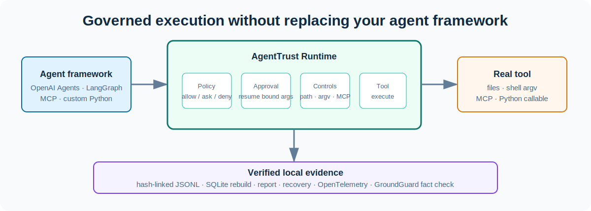
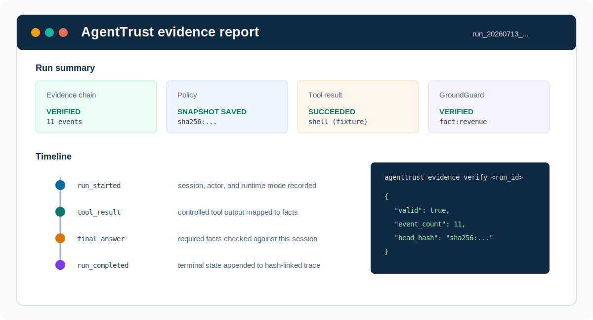

<p align="center">
  
</p>

<h1 align="center">AgentTrust Runtime</h1>

<p align="center">
  <strong>Policy, approvals, recovery, and verifiable evidence for AI agent tool calls.</strong>
</p>

<p align="center">
  Wrap OpenAI Agents, LangGraph, Pydantic AI, MCP, or custom Python tools with fail-closed local controls without replacing the agent framework.
</p>

<p align="center">
  <a href="README.md">English</a> | <a href="README_zh.md">中文</a> | <a href="docs/index.md">Documentation</a> | <a href="CHANGELOG.md">Changelog</a> | <a href="SECURITY.md">Security</a> | <a href="docs/refactor-roadmap.md">Roadmap</a>
</p>

<p align="center">
  <a href="https://github.com/chasen2041maker/AgentTrust-Runtime/actions/workflows/ci.yml"></a>
  
  
  
</p>

<p align="center">
  
  
  
  
  
</p>



> **v0.7.0 Beta / developer preview.** AgentTrust is suitable for local development, integration validation, and deterministic control regression. It is not a production-security guarantee. Review permissions, perform threat modeling, and use environment-level safeguards before connecting real systems.

## What is AgentTrust?

An agent framework decides what it wants to do. AgentTrust governs what happens when that decision reaches a real tool.

For each tool call, it answers and records:

1. Is the call allowed, denied, or waiting for human approval?
2. Do its paths, command arguments, MCP trust state, and recovery boundaries pass control checks?
3. Which actor, session, policy snapshot, and arguments produced the result?
4. Can a paused, approved call be replayed with the original arguments after a restart?
5. Does the final answer cite facts recorded in the same session?

It is intentionally a control layer, not an agent planner, model provider, workflow engine, dashboard, or cloud policy service.

## 30-second proof

The package is not published to PyPI yet. Install the current beta directly from this repository, then run a deterministic session that creates evidence, facts, a GroundGuard report, and an HTML report.

```powershell
python -m pip install "agenttrust-runtime @ git+https://github.com/chasen2041maker/AgentTrust-Runtime.git"
mkdir agenttrust-demo
cd agenttrust-demo
agenttrust init
agenttrust run-fixture verified_answer --mode test
agenttrust evidence verify <run_id>
agenttrust report <run_id> --format html
```

Expected evidence verification:

```text
{
  "valid": true,
  "event_count": 11,
  "head_hash": "sha256:..."
}
```

The run directory contains the artifacts that actually occurred on that path:

```text
trace.jsonl             # Local, append-oriented, hash-linked event source
trace-head.json          # Verified append checkpoint for the trace head
trace-anchor.json        # Optional Ed25519 signature for one verified trace head
policy-snapshot.yaml    # Exact policy text used for the run
facts.jsonl             # Structured facts mapped from tool results, when present
groundguard-report.json # Final-answer verification result, when finalized
report.md / report.html # Generated from the verified run timeline
```

`trace.jsonl` detects modifications inside its hash chain. An optional Ed25519 anchor signs one verified head, but it becomes a signer-identity check only when the verifier pins a public key obtained independently. Neither form provides a trusted timestamp, external witness, immutable storage, or non-repudiation.

## First governed session

Use an `AgentTrustSession` inside an existing agent loop. This example pauses a code write for approval instead of executing it immediately.

```python
from pathlib import Path

from agenttrust import AgentTrustRuntime

runtime = AgentTrustRuntime(Path("."), runtime_mode="interactive", approval_mode="deferred")

with runtime.session(actor_id="alice", agent_id="coding-agent") as session:
    outcome = session.execute(
        "write_file",
        {"path": "src/report.py", "content": "print('hello')\n"},
    )

    if outcome.approval_request:
        print("Approval required:", outcome.approval_request.approval_id)
        print("Evidence:", session.run_dir / "trace.jsonl")
```

Approve and resume the same call with its argument digest still bound to the approval record:

```powershell
agenttrust approvals list
agenttrust approvals inspect <approval_id>
agenttrust approvals approve <approval_id> --reason "reviewed"
agenttrust run resume <run_id>
```

## V0.6: policy protocol and async runtime

The built-in YAML engine still accepts the existing policy format, while v0.6 exposes a portable request/response contract for external policy integrations. `policy explain` reports every matching rule, the tool default, and the precedence-selected decision; `lint` and `test` keep policy changes reviewable in CI.

```powershell
agenttrust policy lint .agenttrust/policy.yaml
agenttrust policy test .agenttrust/policy.yaml policy-fixtures.json
agenttrust policy explain .agenttrust/policy.yaml --tool write_file --path src/report.py
agenttrust policy export .agenttrust/policy.yaml --name local-baseline --version 1.0.0 --output policy-pack.json
agenttrust policy inspect-pack policy-pack.json
agenttrust policy import policy-pack.json --output imported-policy.yaml
```

Use the async API when the hosting agent framework already owns an event loop. Native async handlers are awaited directly; built-in synchronous tools remain available through the gateway compatibility adapter.

```python
from agenttrust import AgentTrustRuntime, govern_async

runtime = AgentTrustRuntime(Path("."), runtime_mode="test")

async with runtime.async_session(actor_id="alice") as session:
    async def summarize(text: str) -> str:
        return text.upper()

    governed_summarize = govern_async(
        summarize, session=session, tool_name="summarize", default_effect="allow"
    )
    assert await governed_summarize("ready") == "READY"
```

A session can now hold more than one deferred approval. Decide each approval normally, then resume the intended call explicitly when there is more than one candidate:

```powershell
agenttrust run resume <run_id> --tool-call-id call_002
```

For development installation and test commands, see [Contributing](CONTRIBUTING.md).

## V0.7: portable policy packs

`policy export` writes the policy semantics AgentTrust actually enforces as a local `agenttrust.policy-pack/v1` JSON artifact. It contains a name, version, normalized policy v1 payload, and a canonical SHA-256 digest; `inspect-pack` validates all of them before printing. `policy import` validates first and refuses to overwrite an existing YAML policy unless `--force` is explicit.

Policy packs are offline review artifacts, not a remote marketplace or a trust system. The digest detects corruption or stale edits inside a pack; it does not authenticate a malicious party that creates a new pack and recomputes its digest. Review the source and use signed evidence or a separately pinned digest for stronger provenance.

## V0.7: signed evidence anchors

Install the optional signing dependency, generate a passphrase-encrypted key pair, then sign a completed run. Keep the private key outside the repository and distribute the public key through an independent trusted channel.

```powershell
python -m pip install "agenttrust-runtime[signing] @ git+https://github.com/chasen2041maker/AgentTrust-Runtime.git"
# Set this through your shell or CI secret store. Do not commit it.
$env:AGENTTRUST_EVIDENCE_KEY_PASSPHRASE = "<secret>"
agenttrust evidence keygen --private-key .agenttrust/keys/evidence-private.pem --public-key .agenttrust/keys/evidence-public.pem --passphrase-env AGENTTRUST_EVIDENCE_KEY_PASSPHRASE
agenttrust evidence anchor <run_id> --private-key .agenttrust/keys/evidence-private.pem --passphrase-env AGENTTRUST_EVIDENCE_KEY_PASSPHRASE
agenttrust evidence verify-anchor <run_id> --public-key .agenttrust/keys/evidence-public.pem
```

`anchor` signs the exact verified `run_id`, event count, head hash, signing time, and key fingerprint. Any later append or chain rewrite causes `verify-anchor` to fail until an authorized signer creates a fresh anchor.

## Why AgentTrust?

| Capability | Prompt guardrail | Observability | Sandbox | AgentTrust |
| --- | --- | --- | --- | --- |
| Policy before tool execution | Limited | No | Sometimes | Yes |
| Human approval | Limited | No | No | Resumable |
| Path and tool controls | No | No | Yes | Yes |
| Evidence | No | Trace only | No | Hash-linked local JSONL |
| Restore governed writes | No | No | Snapshot-dependent | Verified run artifacts |
| Final-answer fact check | No | No | No | GroundGuard-backed |
| Replaces an agent framework | No | No | No | No |

The comparison describes scope, not a claim that any single category covers every deployment risk.

## Product highlights

| Policy gate | Resumable approvals | Path and tool controls |
| --- | --- | --- |
| Every tool call evaluates to `allow`, `ask`, or `deny`; unknown tools fail closed. [Concepts](docs/concepts.md) | Pause a session, decide later, and resume the original arguments after verified replay. [CLI](docs/cli.md) | Govern local files, safe shell argv, MCP calls, and custom Python functions. [Architecture](docs/ARCHITECTURE.md) |

| Evidence and replay | Recoverable writes | Final-answer verification |
| --- | --- | --- |
| Store a local hash-linked trace, rebuild SQLite projections, and export spans. [Evidence](docs/concepts.md) | Back up governed file writes and restore through a verified trace. [Recovery](docs/cli.md) | Check required answer claims against facts from the same session. [GroundGuard](docs/concepts.md) |

## How it works

1. Normalize a framework callback, MCP request, or custom callable into a `ToolIntent`.
2. Evaluate policy and registered-tool defaults. Unregistered tools fail closed.
3. Validate file paths, safe shell `argv`, or MCP consent, trust, and command/schema fingerprints.
4. Persist an approval request if the decision is `ask`; otherwise run the governed tool.
5. Append lifecycle events, map facts, and project query state into SQLite.
6. Replay verified evidence for recovery, reporting, OpenTelemetry export, and final-answer verification.

The evidence path is shown separately because SQLite is a rebuildable projection, not the source of truth for a resumed run.

## Integrations

AgentTrust keeps the caller's session rather than making a new run for every wrapped tool.

| Integration | Entry point | Runnable example |
| --- | --- | --- |
| OpenAI Agents SDK | `agenttrust.integrations.openai_agents` | `python examples/openai_agents_sdk_adapter.py` |
| LangGraph | `agenttrust.integrations.langgraph` | `python examples/langgraph_tool_adapter.py` |
| Pydantic AI | `agenttrust.integrations.pydantic_ai` | `python examples/pydantic_ai_adapter.py` |
| Custom Python | `govern()` / `@governed_tool(...)` | [Session API](#first-governed-session) |

The examples use fake-model paths and require no API key. Install framework extras only when using their native objects: `.[openai]`, `.[langgraph]`, or `.[pydantic-ai]`.

## Local MCP stdio governance

AgentTrust separates reading an MCP configuration from starting a server:

```text
static discovery -> inspect -> explicit consent -> tools/list -> tool trust
-> command and schema fingerprint -> tools/call -> evidence
```

```powershell
agenttrust mcp discover
agenttrust mcp inspect <server-or-config>
agenttrust mcp consent grant <server>
agenttrust mcp trust <server> --tool read_file
```

- Discovery and inspection do not start the server or print environment-variable values.
- Real calls require both server consent and tool-level trust.
- Command, description, and input-schema drift invalidate trust and block subsequent calls.
- A real stdio process receives only a small OS-runtime environment allowlist plus `env` values explicitly declared in the inspected MCP config. It starts in the config directory with inherited file descriptors closed; the trace records the mode and counts, never values.
- Simulated calls are accepted only in test mode or when the runtime explicitly enables simulation; their facts are marked `test_only` and cannot verify a normal final answer.
- Sandbox profiles are policy metadata today; they are **not** OS-level process or network isolation.

## Evidence, recovery, and reports



Evidence events are append-oriented, hash-linked JSONL records. New v1 events include a portable envelope, while verified readers migrate v0.5 traces in memory for compatibility. `trace-head.json` makes ordinary appends constant-time with respect to prior event count; stale checkpoints fall back to full verification. `agenttrust evidence verify` validates a trace before replay, restore, or OpenTelemetry export; `agenttrust evidence anchor` optionally signs a verified head with Ed25519. `agenttrust state rebuild` can reconstruct the local SQLite projection from verified traces.

For a governed `write_file`, the runtime records a restore point only after the write succeeds and binds the actual post-write digest. Restore is preview-only by default; a changed target is skipped unless `--force` is explicitly supplied.

```powershell
agenttrust evidence verify <run_id>
agenttrust evidence export <run_id>
agenttrust evidence verify-anchor <run_id> --public-key <trusted-public-key.pem>
agenttrust state rebuild
agenttrust restore <run_id>
agenttrust restore <run_id> --apply
agenttrust report <run_id> --format html
```

Install `.[otel]` to rebuild evidence as OTLP HTTP spans for a backend such as Phoenix, Jaeger, Tempo, or Langfuse. AgentTrust does not ship a dashboard.

## Final-answer verification

`finalize_answer()` records a final answer and checks requested fact keys against facts produced in the current session. This adds a checkable link between a tool result and a claim; it does not prove the completeness or truth of arbitrary model output.

`groundguard-report.json` records the originating run ID as its verification session. When the GroundGuard extra is installed, AgentTrust passes that same ID directly to `FactGate`, so the external fact report and the hash-linked trace share one session identifier.

Set `verification.mode: groundguard_required` in policy to fail closed on missing or invalid GroundGuard output. The default `fallback` mode keeps the deterministic built-in verifier available for local development.

```python
result = session.finalize_answer(
    "Revenue was $3.83 billion [fact:revenue].",
    required_fact_keys=["revenue"],
)
assert result.status == "verified"
```

## Security regression suite

`security-v1` is a public deterministic control regression suite, not a penetration test or a claim of complete coverage against arbitrary agent attacks. It does not execute supplied shell commands or user-configured MCP servers; its first drift case starts only the packaged fake stdio server.

```powershell
agenttrust benchmark security --output benchmark-report.json
```

An execution on the v0.5.1 codebase produced:

```text
107 deterministic checks
100 expected blocks / 100 detected blocks
7 expected-allow baselines
0 false positives / 0 false negatives / 0 critical bypasses
```

The JSON result includes case IDs, expected and observed outcomes, category counts, and policy latency. Reproduce it with the command above; performance depends on your Python and operating-system environment. The public case definitions and limitations are in [the benchmark guide](benchmarks/README.md).

## Use cases

**Coding agents**: require review before source writes or shell execution, then retain recovery artifacts.

**Local MCP clients**: apply explicit consent, per-tool trust, and schema-drift checks to local servers.

**Research and data agents**: retain tool-produced facts and check final reports against them.

**Regulated or audited workflows**: keep actor, session, policy, approval, tool-result, and final-answer evidence together.

## Project status and limitations

**Status: Beta.** The runtime has production-shaped local controls, but it is still a developer preview.

Available now:

- Session-scoped execution, persisted approval records, and replay from verified local evidence.
- Local MCP stdio consent, tool trust, and drift checks.
- Versioned policy and evidence contracts, import/exportable normalized policy packs, async session execution, hash-linked evidence, optional Ed25519 trace-head signatures, SQLite projection rebuild, report generation, and OTLP export.
- GroundGuard-backed checks for required facts in a final answer.

Known limitations:

- An Ed25519 anchor is a local signature artifact, not an external witness. It establishes signer identity only when verification pins a public key obtained independently.
- Policy-pack digests detect an inconsistent artifact but do not authenticate the policy author or replace policy review.
- Local evidence has no trusted timestamp, external witness, or immutable storage anchor. Same-run evidence and state transitions use a cross-platform run lock.
- Custom functions wrapped with `govern()` must be registered again after a restart before resume.
- Approval requests default to a one-hour TTL, configurable with `approvals.default_ttl_seconds` or a session override.
- MCP sandbox profiles do not enforce OS-level process or network isolation.
- File restoration is not a general-purpose transaction or rollback mechanism.

## Roadmap

The next reliability work focuses on external evidence witnessing or immutable storage, OS-level MCP isolation, and broader policy-pack interoperability. The broader implementation history and planned boundaries are in the [architecture roadmap](docs/refactor-roadmap.md) and [enterprise architecture](docs/enterprise-architecture.md).

## Documentation

- [Getting started](docs/getting-started.md)
- [CLI reference](docs/cli.md)
- [Core concepts](docs/concepts.md)
- [Protocol and async runtime](docs/protocols.md)
- [Runtime architecture](docs/ARCHITECTURE.md)
- [Threat model](docs/THREAT_MODEL.md)
- [Related work and boundaries](docs/RELATED_WORK.md)
- [Benchmark guide](benchmarks/README.md)
- [Changelog](CHANGELOG.md)
- [Security policy](SECURITY.md)

## Community and contributing

Contributions are welcome when they strengthen a concrete, deterministic runtime control. Start with [CONTRIBUTING.md](CONTRIBUTING.md), open an issue with a focused reproduction, and report potential security vulnerabilities privately as described in [SECURITY.md](SECURITY.md).

## License

[MIT](LICENSE)
