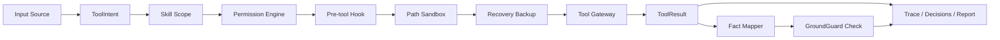

# AgentTrust Runtime Architecture

AgentTrust Runtime implements a narrow, local-first control path for governed agent tool execution.

It is deliberately not a full agent framework. The runtime focuses on one question:

> Before an agent tool call mutates or reads local state, can we decide, record, and later replay why it was allowed or denied?

GroundGuard answers the later question:

> Once the agent writes a final answer, is that answer supported by facts recorded from this run?

AgentTrust connects those two questions into one run artifact.

## Control Path



## Input Sources

Supported sources:

- `fixture`: deterministic demos and tests.
- `live_adapter`: minimal `run-live fake_tool_request` adapter.
- `mcp_lite`: MCP wrapper fixture normalized as `ToolIntent(tool_name="mcp_tool")`.
- `skill_lite`: local `SKILL.md` plus `policy.yaml` bound to a run.

All sources share the same permission, sandbox, gateway, trace, fact mapping, and report path.

## Module Boundaries

```text
agenttrust/
  schemas.py                  # ToolIntent / ToolResult
  cli.py                      # command-line interface
  permissions/
    policy.py                 # YAML policy loading and rule matching
    engine.py                 # allow / ask / deny evaluation
    approvals.py              # runtime-mode finalization
    sandbox.py                # project-root and secret path checks
    hooks.py                  # pre_tool hook decisions
  runtime/
    fixtures.py               # deterministic run source
    live.py                   # minimal live adapter
    gateway.py                # tool dispatch
    trace.py                  # append-only trace writer
    report.py                 # replay / markdown / html reports
    recovery.py               # write_file backup and restore
  tools/
    file.py                   # read_file / write_file
    shell.py                  # shell execution and simulated output
    git.py                    # git_diff
    mcp.py                    # MCP Lite wrapper
    skill.py                  # skill_context pseudo-tool
    registry.py               # tool surface metadata
  groundguard_adapter/
    mapper.py                 # ToolResult -> Fact
    verifier.py               # FactGate adapter with deterministic fallback
  mcp_lite.py                 # MCP config inspection
  skills_lite.py              # local SKILL.md loader
  memory_lite.py              # explicit memory store
  context_lite.py             # deterministic context pack builder
```

## Runtime Controls

- Permission Engine evaluates YAML policy rules with `allow`, `ask`, and `deny`.
- Tool Registry default effects provide a safety fallback when no policy rule matches.
- Noninteractive `ask` becomes `deny` with `reason=approval_required`.
- Interactive `ask` records an approval request and waits for approve/deny.
- Test mode uses a mock approver and turns `ask` into `allow`.
- Skill Lite denies tools outside the selected skill policy before permission.
- Hook Lite runs after the tentative permission decision and before sandboxing.
- Path Sandbox resolves paths, keeps file operations inside `project_root`, blocks secret files, and records sandbox decisions.
- Recovery Lite creates backups before `write_file` mutation and constrains restore to project/run directories.

## Tool Surface

Built-in tools:

- `read_file`
- `write_file`
- `shell`
- `git_diff`

Lite wrapper tools:

- `mcp_tool`
- `skill_context`

The Tool Registry exposes name, category, input schema, default permission effect, enabled state, and source.

## Run Artifacts

Each run writes artifacts under `.agenttrust/runs/{run_id}/`:

- `trace.jsonl`
- `decisions.json`
- `facts.jsonl`
- `final-answer.md`
- `groundguard-report.json`
- `report.md`
- `report.html`
- `backups/`
- `context-pack.md`
- `context-manifest.json`

Trace is append-only. This implementation does not provide a tamper-evident hash chain.

## Design Principles

1. **Local-first:** no hosted service is required.
2. **Deterministic:** fixtures and tests do not require an LLM.
3. **Narrow waist:** all sources become `ToolIntent`, and all tool outputs become `ToolResult`.
4. **Explicit evidence:** facts must be explicitly mapped; the runtime does not infer arbitrary truth.
5. **Replayable:** every important decision is written as an artifact.
6. **GroundGuard-compatible:** final-answer verification reuses GroundGuard's FactGate when available.
