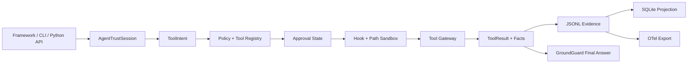

# 运行时架构

AgentTrust Runtime 是一个 ports-and-adapters 风格的本地执行控制层。它不编排 Agent；外部框架、CLI 或自定义循环把工具请求交给它后，运行时负责策略、审批、沙箱、证据、恢复与最终答案核验。

## 控制路径



一个 session 的每次工具调用都带相同的 `run_id`、`actor_id`、`agent_id`、`session_id` 和 `policy_version`。`tool_call_id` 单调递增，避免把多个 Agent 任务混入同一审计单元。

## 生命周期

```text
created -> running -> completed
                  -> failed
                  -> cancelled
                  -> waiting_approval -> running
```

工具调用状态是 `requested`、`policy_denied`、`waiting_approval`、`approved`、`sandbox_denied`、`executing`、`succeeded` 或 `failed`。领域状态转换在 `domain/lifecycle.py` 内校验，不允许接口层任意改写。

## 分层与依赖规则

```text
domain/        纯模型、策略、状态机、审批摘要；只依赖标准库和 domain
application/   use case 与 port；依赖 domain，不导入具体 adapter
adapters/      YAML、JSONL、SQLite、文件、shell、MCP、GroundGuard、OTel
interfaces/    CLI 与 Python SDK，负责组合并调用 application
integrations/  OpenAI Agents、LangGraph、Pydantic AI 的 session 复用包装
benchmark/     公开的确定性安全控制回归数据集
```

兼容模块保留旧 import 路径，但真正的实现位于边缘 adapter。架构边界测试确保 domain 不依赖 CLI、YAML、文件系统或 subprocess，application 不直接导入具体 adapter。

## 存储模型

```text
.agenttrust/
  policy.yaml
  state.db
  mcp-consent.json
  mcp-trust.json
  runs/{run_id}/
    trace.jsonl
    trace-head.json
    facts.jsonl
    approvals.jsonl
    policy-snapshot.yaml
    groundguard-report.json
    backups/
```

- `trace.jsonl` 是 append-only evidence 源。v1 事件包含上一事件 hash、自身 hash 和可移植 envelope；已验证读取兼容 v0.5 扁平事件。
- `trace-head.json` 保存已验证 head、文件大小和修改时间，使正常 append 无需扫描完整 trace；检查点不匹配时回退到完整验证。
- `state.db` 是 session、tool call 和 approval 的查询投影，不是信任根。
- `agenttrust state rebuild` 会先验证 trace，再从 JSONL 重建 SQLite。
- policy snapshot 与 identity 被绑定到每个 evidence event；恢复不使用后来修改过的项目 policy。

## 策略、审批和沙箱

策略返回 `allow`、`ask` 或 `deny`。未匹配规则时静态 Tool Registry 提供默认效果；没有注册的工具直接返回 `unregistered_tool`。`ask` 的最终效果取决于运行模式：interactive 等待决定、noninteractive 拒绝、test 由确定性 mock approver 放行。

`PathSandbox` 将文件工具限制在 project root 内，拒绝系统路径、`.env`、PEM 与 SSH 路径。对写入，它先解析父目录再计算目标，降低新路径和符号链接逃逸的风险。恢复同时约束目标路径与 backup 路径。

## MCP 边界

真实 stdio MCP 的执行顺序是：静态发现、inspect、consent、`tools/list`、tool trust、fingerprint 校验、`tools/call`。command hash、工具 description hash 和 input schema hash 都进入信任记录；漂移使记录失效，调用被拒绝并写入 evidence。启动真实进程时，adapter 只传递小型 OS 运行时环境白名单与 MCP config 中显式声明的 `env`，以 config 目录为工作目录并关闭继承句柄；evidence 保存模式和数量而不保存变量值。

## Policy Pack 边界

`adapters/policy/pack.py` 把 runtime-normalized `Policy` 导出为 `agenttrust.policy-pack/v1` JSON，并在导入前重新验证协议版本、字段形状和 canonical digest。pack 不是远程安装机制，导入也不会默认覆盖 `.agenttrust/policy.yaml`；digest 确保 artifact 内部一致，不构成作者身份签名。

## 最终答案与可观测性

工具结果经 mapper 形成显式 facts；`finalize_answer()` 将答案与同一 session 的 facts 交给 GroundGuard，并将本次 `run_id` 作为 FactGate session ID 写入核验报告和 evidence。证据 export 不创建第二个事实源：OTel adapter 从 JSONL 重建 `agenttrust.session`、工具阶段和最终答案 span，供 OTLP 后端消费。
