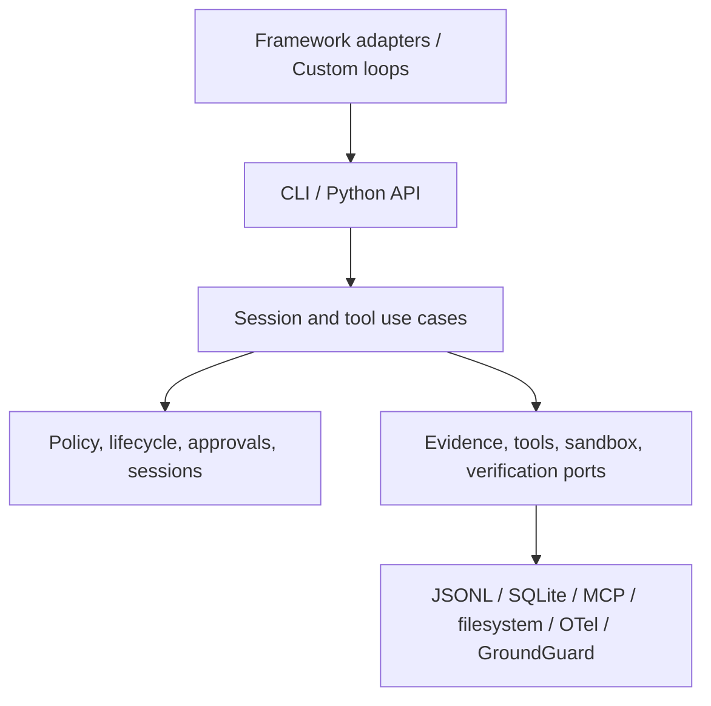

# 架构演进方案

AgentTrust Runtime 已把最关键的执行控制路径落在本地：外部 Agent 框架将请求归一化为 `ToolIntent`，session runtime 执行策略、审批、沙箱、工具、evidence、事实核验与 telemetry export。

## 目标定位

> AgentTrust Runtime 是位于 Agent 框架与真实工具之间的 local-first execution control layer。它负责策略、可恢复审批、sandbox、evidence 和 GroundGuard-backed final-answer checks，而不负责 Agent 编排。

## 当前架构

核心证据模型是 JSONL source-of-truth 与 SQLite derived projection。每次 run 固定身份和策略快照，hash chain 可以独立验证，等待审批可以在重启后恢复。

## 外部模式对齐

| 外部模式 | AgentTrust 已采纳的部分 | 保持的边界 |
| --- | --- | --- |
| OpenAI Agents / LangGraph | session、human-in-the-loop、恢复与 framework wrapper | 不编排 Agent graph。 |
| Microsoft Agent Governance Toolkit | 低摩擦工具治理、policy、identity、evidence | 不构建企业云平台。 |
| MCP 安全实践 | 静态 inspect、consent、least privilege、schema drift | 仅本地 stdio 的最小可信网关。 |
| Phoenix / Jaeger / Tempo / Langfuse | 标准 OTel/OTLP span | 不内置 Dashboard。 |
| NIST AI RMF / OWASP | 以可测控制和安全基准固化风险 | 不宣称覆盖全部风险类别。 |

参考来源：

- https://modelcontextprotocol.io/docs/tutorials/security/security_best_practices
- https://genai.owasp.org/resource/owasp-top-10-for-agentic-applications-for-2026/
- https://developers.openai.com/api/docs/guides/agents
- https://openai.github.io/openai-agents-python/tracing/
- https://learn.microsoft.com/en-us/agent-framework/overview/
- https://github.com/microsoft/agent-governance-toolkit
- https://www.nist.gov/itl/ai-risk-management-framework

## 控制矩阵

| 控制 | 当前实现 | 验证方法 |
| --- | --- | --- |
| 策略与未知工具 | allow/ask/deny，registry fail-closed | permissions tests、security-v1 |
| 审批 | SQLite/JSONL 持久化，参数摘要绑定，resume/cancel | approval/recovery tests |
| 身份与政策 | actor/agent/session/policy version 写入 evidence | session tests |
| 文件恢复 | run-local backup 和路径约束 | recovery tests |
| MCP | consent、trust、command/schema drift | real stdio fixture tests |
| evidence | hash-linked JSONL、state rebuild | tamper/rebuild tests |
| 可观测性 | OTel 从 evidence 重建 span | in-memory exporter test |
| 最终答案 | GroundGuard 与 session facts 绑定 | final-answer tests |
| 安全回归 | 100 个公开确定性攻击案例 | benchmark CLI/test |

## 有意延后

远程 policy 服务、组织身份、网络 egress 控制、Dashboard、远程 evidence witness、更多语言 SDK 与大量框架适配仍不属于本阶段。它们必须建立在已验证的本地控制路径之上，而不是稀释这一层。
