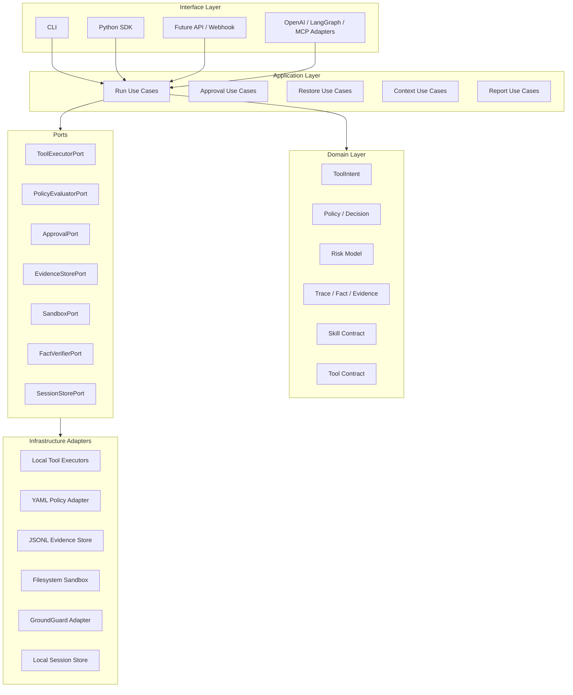

# Enterprise Architecture Upgrade

This document describes the target architecture for evolving AgentTrust Runtime from a compact local-first demo runtime into an enterprise-ready agent execution control plane.

It is based on the current codebase and on current public patterns from MCP security guidance, OWASP agentic risk guidance, OpenAI Agents SDK runtime concepts, Microsoft Agent Framework / Agent Governance Toolkit, and NIST AI RMF.

## Executive Summary

AgentTrust should keep its current narrow waist:

```text
all agent sources -> ToolIntent -> governed execution -> ToolResult -> evidence artifacts
```

The enterprise upgrade is not to turn AgentTrust into a full agent framework. The upgrade is to make the governance runtime easier to extend, audit, and embed in existing agent frameworks.

Target positioning:

> AgentTrust Runtime is the local-first execution control plane between an agent framework and real tools. It owns policy decisions, approvals, sandboxing, evidence capture, recovery, and GroundGuard-backed final-answer checks.

## External Alignment

| External Pattern | Enterprise Requirement | AgentTrust Direction |
| --- | --- | --- |
| MCP security best practices | Local MCP servers need explicit consent, command visibility, sandboxing, and least privilege. | Promote MCP Lite into an MCP Adapter layer with consent records, server trust metadata, and sandbox profiles. |
| OWASP Agentic Top 10 | Agentic systems need operational controls for autonomous planning, tool use, and decision-making. | Add policy packs and risk mapping for tool misuse, identity/privilege abuse, supply chain, memory/context poisoning, and unintended code execution. |
| OpenAI Agents SDK | Mature agent runtimes expose tools, sessions/state, guardrails, approvals, and tracing. | Keep AgentTrust framework-agnostic, but model those as explicit ports: session store, approval service, guardrail service, trace exporter. |
| Microsoft Agent Framework | Enterprise agents need session state, type safety, filters/middleware, telemetry, and explicit workflows. | Split core domain from adapters; add typed policy/evidence models and middleware-like execution stages. |
| Microsoft Agent Governance Toolkit | Production governance asks: is the action allowed, which agent did it, and can you prove what happened. | Add identity, agent/run attribution, tamper-evident evidence chains, and policy evaluation reports. |
| NIST AI RMF | Risk management should support governance, mapping, measurement, and management across lifecycle. | Add controls inventory, risk mapping, test evidence, and release gates to docs and artifacts. |

Reference sources:

- MCP Security Best Practices: https://modelcontextprotocol.io/docs/tutorials/security/security_best_practices
- OWASP Top 10 for Agentic Applications 2026: https://genai.owasp.org/resource/owasp-top-10-for-agentic-applications-for-2026/
- OpenAI Agents SDK guide: https://developers.openai.com/api/docs/guides/agents
- OpenAI Agents SDK tracing: https://openai.github.io/openai-agents-python/tracing/
- Microsoft Agent Framework overview: https://learn.microsoft.com/en-us/agent-framework/overview/
- Microsoft Agent Governance Toolkit: https://github.com/microsoft/agent-governance-toolkit
- NIST AI Risk Management Framework: https://www.nist.gov/itl/ai-risk-management-framework

## Target Layered Architecture



Dependency rule:

```text
domain -> no imports from application, adapters, CLI, filesystem, YAML, subprocess
application -> imports domain + ports only
adapters/infrastructure -> implement ports and may import external libraries
interfaces -> parse inputs and call application use cases
```

## Proposed Package Structure

Current code is readable, but responsibilities are still grouped by feature file. The next architecture should move toward ports-and-adapters without breaking the CLI.

```text
src/agenttrust/
  domain/
    models.py                  # ToolIntent, ToolResult, Fact, EvidenceEvent
    decisions.py               # PermissionDecision, HookDecision, SandboxDecision
    policy.py                  # Policy, PolicyRule, HookRule
    risk.py                    # RiskCategory, RiskFinding, ControlMapping
    skill.py                   # SkillContract, OutputContract
    errors.py                  # domain exceptions

  application/
    run_tool.py                # RunToolUseCase
    run_fixture.py             # RunFixtureUseCase
    approve_tool.py            # Approval use cases
    restore_run.py             # RestoreRunUseCase
    build_context.py           # ContextPackUseCase
    generate_report.py         # ReportUseCase
    ports.py                   # ToolExecutorPort, EvidenceStorePort, etc.

  adapters/
    tools/
      file.py
      shell.py
      git.py
      mcp.py
      skill_context.py
    policy/
      yaml_policy.py
      tool_registry_defaults.py
    evidence/
      jsonl_store.py
      reports.py
    verification/
      groundguard.py
    sandbox/
      filesystem.py
    context/
      local_memory.py
      context_pack.py

  interfaces/
    cli.py
    python_api.py
    future_http.py

  runtime/
    pipeline.py                # stage orchestration, compatible facade
    compatibility.py           # old import paths during migration
```

## Execution Pipeline

Enterprise execution should be a typed pipeline with individually testable stages:

```text
1. Receive source request
2. Normalize to ToolIntent
3. Attach actor/session identity
4. Load skill/context scope
5. Evaluate policy
6. Evaluate hook/risk controls
7. Request approval if needed
8. Sandbox path/process/network
9. Create recovery checkpoint
10. Execute tool through ToolExecutorPort
11. Map ToolResult to Facts
12. Verify final answer through FactVerifierPort
13. Persist evidence and reports
14. Export trace/telemetry
```

Each stage should emit an `EvidenceEvent` with:

- `run_id`
- `stage`
- `actor_id`
- `tool_call_id`
- `decision`
- `policy_version`
- `risk_tags`
- `input_digest`
- `output_digest`
- `created_at`

## Bounded Contexts

| Context | Owns | Should Not Own |
| --- | --- | --- |
| Execution Governance | Tool intents, policy decisions, approval state, sandbox decisions. | GroundGuard matching logic or agent orchestration. |
| Evidence & Audit | Trace events, facts, reports, restore events, context manifests. | Tool implementation details. |
| Tool Surface | Tool registry, tool schemas, default risk/effect, adapter metadata. | Policy storage or final-answer verification. |
| Skill & Context | Local skills, memory, context packs, output contracts. | Arbitrary LLM prompt optimization. |
| Recovery | Write checkpoints, restore manifests, restore constraints. | Full git worktree management. |
| Integrations | MCP config, framework adapters, future SDK/HTTP entrypoints. | Domain decision rules. |

## Enterprise Control Matrix

| Control | Current State | Enterprise Upgrade |
| --- | --- | --- |
| Action policy | YAML allow/ask/deny rules. | Versioned policy bundles, policy evaluation report, signed policy snapshot per run. |
| Approval | CLI interactive/test/noninteractive handling. | Resumable approval state, approver identity, expiry, reason codes. |
| Identity | `source` and `run_id`. | `actor_id`, `agent_id`, `session_id`, delegated identity, service account separation. |
| Tool registry | Static registry. | Tool capability manifest, risk tier, owner, default sandbox profile, schema version. |
| Sandbox | Filesystem/path sandbox. | Separate filesystem, process, network, and MCP sandbox profiles. |
| MCP | Inspect config and wrapper fixture. | Consent records, trusted server registry, command allowlist, env value policy, OAuth/token checks. |
| Evidence | JSONL trace, decisions, facts. | Hash-chained evidence log, policy snapshot, export format for SIEM/OTel. |
| Recovery | `write_file` backup/restore. | Recovery plans per mutating tool, dry-run impact report, restore authorization. |
| Context | Deterministic local pack. | Context provenance, memory classification, poisoning checks, budget policy. |
| Verification | GroundGuard adapter + fallback. | FactVerifierPort, verifier version, coverage policy gate, report schema contract. |
| Observability | Local replay/report. | Trace exporter port, metrics, spans, run status API. |

## Migration Plan

### Phase 0: Stabilize Current Runtime

Goal: keep the current CLI working while adding architecture seams.

- Add `docs/enterprise-architecture.md`.
- Add `docs/refactor-roadmap.md`.
- Add docs/tests that assert important docs exist.
- Keep existing modules as compatibility facades.

### Phase 1: Extract Domain Models

Goal: domain becomes framework-free.

- Move `ToolIntent`, `ToolResult`, decisions, policy objects, facts into `agenttrust.domain`.
- Keep re-export imports from old modules.
- Add unit tests that domain modules import no `subprocess`, `yaml`, `PathSandbox`, or CLI modules.

### Phase 2: Introduce Application Use Cases And Ports

Goal: runner logic stops living directly inside fixture/CLI code.

- Define ports in `application/ports.py`.
- Extract `RunToolUseCase`, `RunFixtureUseCase`, `RestoreRunUseCase`, `BuildContextUseCase`.
- Convert `runtime/fixtures.py` into a fixture input adapter.
- Add in-memory adapters for tests.

### Phase 3: Move Infrastructure To Adapters

Goal: concrete filesystem, YAML, subprocess, and GroundGuard code lives at the edge.

- Move local tools into `adapters/tools`.
- Move policy YAML loading into `adapters/policy`.
- Move JSONL trace/report into `adapters/evidence`.
- Move sandbox into `adapters/sandbox`.
- Move GroundGuard adapter into `adapters/verification`.

### Phase 4: Enterprise Evidence And Identity

Goal: answer Microsoft AGT's production questions: action allowed, actor known, proof available.

- Add `actor_id`, `agent_id`, `session_id`, `policy_version`.
- Add policy snapshot per run.
- Add hash chain over evidence events.
- Add `agenttrust evidence verify <run_id>`.

### Phase 5: Framework And MCP Integration

Goal: make AgentTrust embeddable, not just CLI-driven.

- Add Python SDK entrypoint for custom agent loops.
- Add OpenAI Agents SDK / LangGraph integration examples.
- Add MCP consent record and trusted-server registry.
- Add network/process sandbox profiles as explicit future interfaces.

## Concrete Next Code Refactor

The smallest safe code upgrade is:

1. Create `agenttrust/domain/models.py` and move `ToolIntent`, `ToolResult`, `utc_now_iso` there.
2. Change `agenttrust/schemas.py` into a compatibility re-export.
3. Create `agenttrust/domain/decisions.py` and move `FinalPermission`, `PermissionDecision`, `SandboxDecision`, `HookDecision`.
4. Keep existing imports working.
5. Add import-boundary tests:
   - domain cannot import CLI;
   - domain cannot import subprocess;
   - domain cannot import YAML;
   - application cannot import concrete tool adapters.

This gives the repo an enterprise architecture direction without risky behavior changes.

## Completion Criteria For The Architecture Upgrade

The architecture upgrade is complete when:

- all existing CLI commands still pass;
- public imports remain compatible;
- domain layer has no infrastructure imports;
- application use cases are testable with in-memory ports;
- every run records actor/session/policy metadata;
- mutating tools have recovery strategies;
- MCP tools require consent and sandbox profiles;
- evidence can be verified independently after a run;
- docs include a control matrix mapped to enterprise agent risks.
